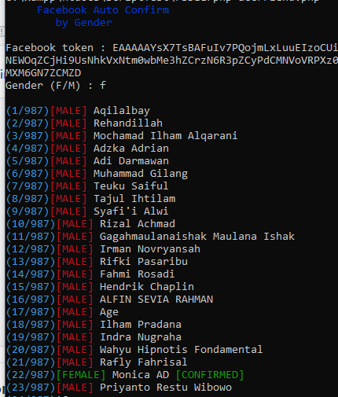

# FacebookConfirmGender
Auto Confirm Friend by Gender

## Install
      $ pkg install php
      $ git clone https://github.com/dandyraka/FacebookConfirmGender.git
      $ cd FacebookConfirmGender

## Run
      $ php confirm.php

## Updating
      $ git pull --force

## Explanation :
- Input :
    - Facebook token `your facebook token (EAAAAA...)`
    - Gender (F/M) `Gender to confirm. F = Female, M = Male`

